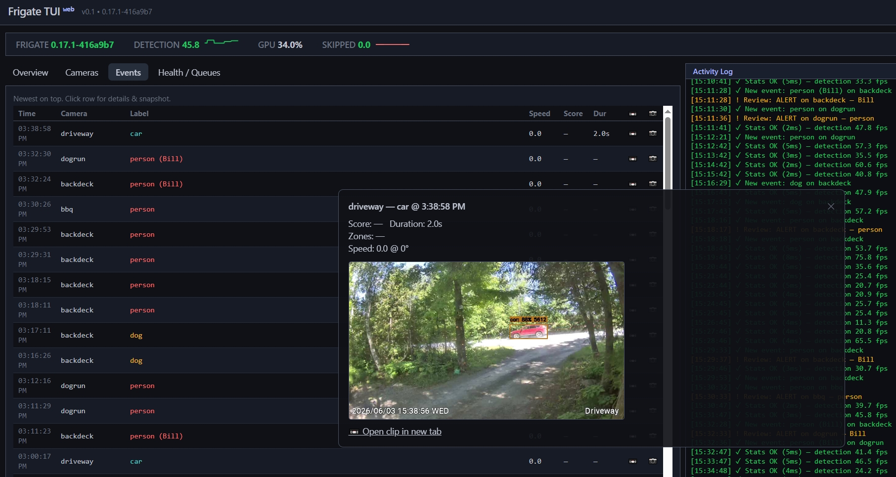
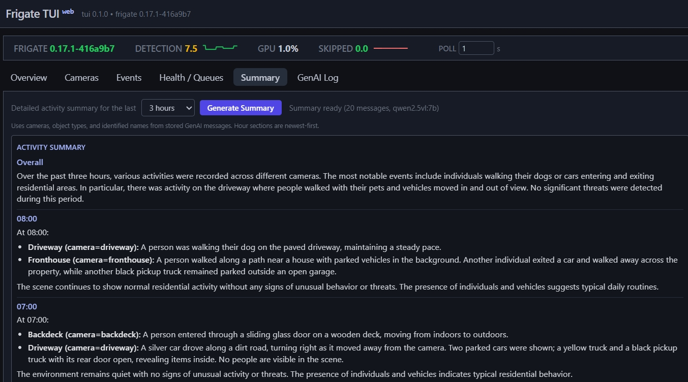
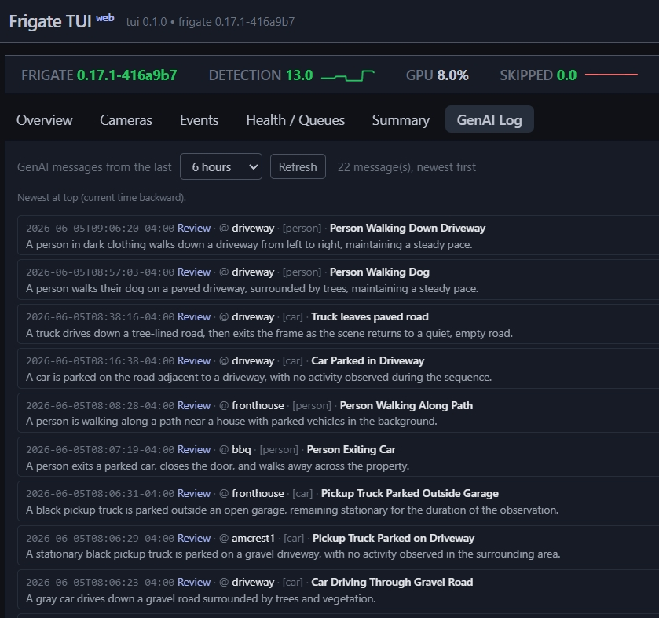

# Frigate TUI

A colorful, advanced terminal user interface **and web dashboard** for monitoring your [Frigate](https://github.com/blakeblackshear/frigate) NVR in real time.

**Created with Grok Build**

Both the TUI and the optional web UI share the exact same core logic (`FrigateMonitorCore`) for stats, health calculations, event handling, MQTT, activity logging, and demo mode — guaranteeing full feature parity.

Watch camera FPS, detector queues / pressure, GPU usage, incoming events, and system health directly from your terminal (or tmux), or in a browser over your local network.



## Features

- Live updating dashboard (1s poll for stats) — available in both **TUI** and **Web**
- **Real-time events via MQTT** (optional but recommended — no polling for new detections)
- **Queues & Health**: Derived detection pressure, skipped frames, inference speed — the signals that matter when the pipeline backs up
- Per-camera view with colorful unicode FPS bars (camera / process / detection)
- Live events feed with object-type color coding (person, car, dog, cat…)
- GPU, storage, uptime, and detector metrics
- **Web dashboard** (optional): full feature parity in the browser, LAN-accessible, with proxied snapshots/clips and live SSE updates
- **GenAI / LLM integration** (Frigate 0.17+): object descriptions and review summaries in the Activity Log; web **Summary** tab (hourly LLM narrative); **GenAI Log** tab (raw messages); Events table **AI Description** column with full text in the event modal
- Keyboard-first navigation (TUI), clean error states, auto-retry
- Works great over SSH and inside tmux (TUI); or over the local network in any browser (Web)





## Requirements

- **Docker** and **Docker Compose**
- **Frigate** 0.13+ (0.17+ for full GenAI metadata), reachable over HTTP from the frigate-tui container
- **Modern terminal** with truecolor (TUI): Kitty, WezTerm, iTerm2, Windows Terminal, etc.
- **MQTT broker** (recommended) — same one Frigate uses, for real-time events and GenAI description updates
- **LLM endpoint** (optional) — Ollama or OpenAI-compatible API for the web **Summary** tab

## Quick Start

Already have Frigate and Docker? See [Installation](#installation) for full steps. Short path:

```bash
git clone https://github.com/datagod/frigate-tui.git && cd frigate-tui
cp config.example.yaml config.yaml   # edit frigate_url / mqtt / genai_report
docker compose build
docker compose --profile web up --build frigate-web   # browser UI on :8080
# or: docker compose run --rm frigate-tui            # terminal UI
```

## Installation

This project runs in **Docker** as a **terminal UI (TUI)** or **web dashboard**. Both services use the same `config.yaml` and core logic.

### 1. Get the project

```bash
git clone https://github.com/datagod/frigate-tui.git
cd frigate-tui
```

Or download and unpack a release archive from GitHub.

### 2. Configure

Copy the example config and edit it for your environment:

```bash
cp config.example.yaml config.yaml
```

**Minimum** — point at Frigate:

```yaml
frigate_url: "http://localhost:5000"   # or http://192.168.1.50:5000
poll_interval: 1.0
```

**Recommended** — MQTT for real-time events and GenAI object descriptions in the Activity Log:

```yaml
mqtt:
  host: "localhost"          # or "mqtt" when sharing Frigate's Docker network
  port: 1883
  username: ""
  password: ""
  topic_prefix: "frigate"
```

Use the same broker host Frigate uses. With `network_mode: container:frigate` (TUI compose), `mqtt.host: mqtt` often works because you share Frigate’s network namespace.

**Optional** — web **Summary** tab (LLM hourly report):

```yaml
genai_report:
  default_hours: 6.0
  base_url: http://127.0.0.1:11434   # Ollama; omit if Frigate config has genai.provider
  model: llama3.2:latest
  timeout: 180
```

**Config file** — compose mounts `./config.yaml` into the container at `/app/config.yaml`. Edit the file on the host and restart the service.

Environment variables override the file (highest priority after CLI flags):

| Variable | Purpose |
|----------|---------|
| `FRIGATE_TUI_URL` | Frigate HTTP base URL |
| `FRIGATE_TUI_INTERVAL` | Stats poll interval (seconds) |
| `DEMO=1` | Run without Frigate (synthetic data) |

See `config.example.yaml` for timeline filters, event polling, and GenAI retention settings.

### 3. Build and run

Docker builds one image; the **web** service adds the `[web]` extra (FastAPI + Uvicorn).

#### Terminal UI (TUI)

Best when Frigate runs in Docker on the same host and the container is named `frigate`:

```bash
docker compose build
docker compose run --rm frigate-tui
```

`docker-compose.yml` uses `network_mode: "container:frigate"` so the TUI reaches Frigate at `http://localhost:5000` and can use Frigate’s MQTT hostname (`mqtt`).

**Different Frigate container name:**

```bash
docker compose run --rm --network container:your-frigate-name frigate-tui
```

Or edit `network_mode` in `docker-compose.yml`.

**Frigate on another host** (no shared container network):

```bash
FRIGATE_TUI_URL=http://192.168.1.50:5000 docker compose run --rm frigate-tui
```

Set `mqtt.host` in `config.yaml` to an address reachable from that network namespace (often your LAN IP or `host.docker.internal`).

**Mount config** — compose already mounts `./config.yaml` → `/app/config.yaml`. Restart after edits.

#### Web dashboard

The web service publishes port **8080** and uses its own network (required for port mapping). It joins external network `ai-network` by default so `FRIGATE_TUI_URL=http://frigate:5000` works when Frigate is on that network.

```bash
# Create the shared network once if you use service names (optional)
docker network create ai-network 2>/dev/null || true

docker compose --profile web up --build frigate-web
```

Open `http://<docker-host-lan-ip>:8080` from any machine on your LAN.

**If Frigate is not on `ai-network`**, override the URL:

```bash
FRIGATE_TUI_URL=http://192.168.1.50:5000 docker compose --profile web up --build frigate-web
```

**Custom port:**

```bash
FRIGATE_WEB_PORT=8765 docker compose --profile web up --build frigate-web
```

Rebuild after code or dependency changes: always include `--build` the first time or after pulling updates.

#### Docker without Compose

```bash
docker build -t frigate-tui .
docker run -it --rm \
  --network container:frigate \
  -v "$(pwd)/config.yaml:/app/config.yaml:ro" \
  -e FRIGATE_TUI_URL=http://localhost:5000 \
  frigate-tui

# Web (build with web extras — see Dockerfile INSTALL_EXTRAS)
docker build --build-arg INSTALL_EXTRAS="[web]" -t frigate-tui .
docker run -d --rm -p 8080:8080 \
  -v "$(pwd)/config.yaml:/app/config.yaml:ro" \
  -e FRIGATE_TUI_URL=http://192.168.1.50:5000 \
  frigate-tui frigate-tui web --host 0.0.0.0 --port 8080
```

### 4. Verify

1. **Activity Log** (TUI right panel or web right column) should show connection success and periodic stats.
2. With MQTT configured: look for **"MQTT connected — receiving events in real time"**.
3. With Frigate GenAI enabled: **LLM:** lines and review summaries as activity occurs.
4. Web: open **Summary** (auto-starts on page load) or **GenAI Log** after messages exist.

If the log shows connection errors, fix `frigate_url` / `FRIGATE_TUI_URL` first, then MQTT host reachability.

### Demo mode (no Frigate)

```bash
# TUI
DEMO=1 docker compose run --rm frigate-tui

# Web
DEMO=1 docker compose --profile web up --build frigate-web
```

### Installation troubleshooting

| Symptom | Things to check |
|---------|------------------|
| Cannot reach Frigate | `frigate_url` / `FRIGATE_TUI_URL`; firewall; Docker network mode vs published ports |
| MQTT never connects | `mqtt.host` reachable from the container; credentials; same broker as Frigate |
| No GenAI / LLM lines | GenAI enabled in Frigate; MQTT for live descriptions; wait for new events/reviews |
| Summary always fails | `genai_report.base_url` and `model`; Ollama running; timeout; Activity Log error detail |
| Web snapshots broken | Browser uses proxied `/api/snapshot` — Frigate must be reachable from the **web** container |
| `ai-network` not found | `docker network create ai-network` or set `FRIGATE_TUI_URL` to a reachable IP |

## Web Interface (Browser Dashboard)

A full web UI with **exact feature parity** to the TUI is available on the same branch.

It re-uses the identical core (`FrigateMonitorCore`) for stats, health/pressure calculations, event list maintenance (dedup, ordering, MQTT vs poll), activity log messages, review/timeline surfacing, connection state, and demo mode. The result is the same numbers, same log lines, and same behavior — just rendered in a browser.

Install via [Docker](#installation). Example run output:

```
Starting Frigate web UI on http://0.0.0.0:8080 (target http://localhost:5000)
Accessible on your network at:
  http://192.168.1.42:8080
```

The UI has six tabs: **Overview**, **Cameras** (FPS bars), **Events**, **Health / Queues**, **Summary** (LLM activity report), and **GenAI Log** (chronological GenAI messages). It also has the persistent Activity Log, top metrics strip, and connection status. Live updates arrive via SSE. Camera cards, color coding, health pressure, and every log message you see in the TUI appear here too.

On first load, the web UI automatically requests a **Summary** report in the background (using `genai_report.default_hours`, typically 6h) so the Summary tab is often ready when you open it.

Keyboard shortcuts that make sense in a browser (`r`, `c`, `1`–`6`, `?`) are supported. Click an event row for a snapshot preview, clip link, full GenAI object description, and linked review summary when available.

### Event alert chimes (web only)

When new detections arrive, the dashboard can play a short chime (queued in order, one at a time). Click **Alerts: Off** in the header once to allow browser audio, then toggle **On** / **Muted**. Configure in `config.yaml`:

```yaml
web_alerts:
  enabled: true
  max_queue: 24
```

### Why a web UI?

- **Exact same features** as the TUI, with zero duplication of the important logic (powered by the shared `FrigateMonitorCore`).
- Works over the local network without SSH/tmux — just open a browser.
- Snapshots and clips are **proxied** through the web server, so they load even if your browser can't directly reach Frigate (common in Docker setups).
- Live updates via SSE (stats, events, activity log, connection status).
- Easy snapshot previews + clip links when clicking events.
- **Summary** and **GenAI Log** tabs for LLM-backed activity review (see below).
- Multiple viewers can watch the same dashboard simultaneously.
- Same configuration, MQTT support, demo mode, and health/queue calculations.

The TUI remains the primary interactive terminal experience (great over SSH); the web dashboard is a first-class peer for LAN/browser access. Both are fully supported.

## GenAI integration

Frigate’s GenAI features (review metadata and per-object LLM descriptions) are surfaced throughout the monitor:

### Activity Log (TUI and web)

- **Object descriptions** — `LLM:` lines when Frigate generates text for a tracked object (`description` on events). Lowest latency with **MQTT** (`frigate/tracked_object_update`); otherwise descriptions appear via HTTP event polling.
- **Review summaries** — one line per review when Frigate writes GenAI metadata (`title`, `shortSummary`, etc.) on `/api/review` items.
- **Summary report status** — start, success, and detailed errors when generating the web Summary (timeouts, HTTP errors, missing LLM config).

Timeline noise (Visible / Gone / Stationary) can be filtered via `timeline_log_*` settings in `config.example.yaml`.

### Web-only: Summary tab

Builds a **markdown activity briefing** for a selectable window (1–24 hours, default from config):

1. Collects stored GenAI messages (reviews + objects) for that window.
2. Sends them to an Ollama / OpenAI-compatible chat endpoint (`POST …/api/chat`).
3. Renders **Overall** plus **hour sections newest-first** (current hour at the top).

Configure the LLM in `config.yaml`:

```yaml
genai_report:
  default_hours: 6.0
  base_url: http://ollama:11434   # optional if Frigate config already has genai.provider
  model: llama3.2:latest
  timeout: 180
```

If `base_url` and `model` are omitted, settings are taken from Frigate’s global `genai` provider when reachable.

The Summary is also kicked off automatically when the web page loads (same default hours).

### Web-only: GenAI Log tab

Shows every GenAI message in the time window, **newest first**, with camera, object type, identified names (`sub_labels`), review title, and full description text.

### Events tab

- **AI Description** column — truncated object description from Frigate GenAI.
- Event modal — full description plus review GenAI block when a matching review exists.

### Requirements

- Frigate with GenAI enabled for your cameras/objects.
- **MQTT recommended** for live description lines in the Activity Log.
- A reachable LLM for the **Summary** tab (`genai_report` or Frigate `genai` settings).

## Configuration

Settings are covered in [Installation → Configure](#2-configure). Priority (highest wins):

1. CLI flags passed in the container `command` (`--url`, `--interval`, …)
2. Environment variables (`FRIGATE_TUI_URL`, `FRIGATE_TUI_INTERVAL`, …)
3. `./config.yaml` (mounted at `/app/config.yaml`)
4. Built-in defaults (`http://localhost:5000`, 1.0s poll interval, 600s / 10min for "Stats OK" messages)

See `config.example.yaml` for the full schema.

Notable config options include:
- `stats_log_interval`: seconds between "Stats OK" messages in the Activity Log (default: 600 / 10 minutes). Errors are always logged immediately.
- `genai_report`: LLM endpoint, model, timeout, and `default_hours` for the web Summary / GenAI Log tabs.
- `genai_activity_hours_keep` / `genai_activity_max`: how long and how many GenAI messages to retain in memory for reports.
- `events_poll_interval` / `events_reconcile_interval`: keep the Events tab aligned with the Activity Log when not using MQTT for every update.

### Real-time Events via MQTT (Recommended)

Instead of polling, you can subscribe to Frigate events over MQTT for near-instant updates.

Add this to your config:

```yaml
mqtt:
  host: "localhost"
  port: 1883
  username: ""
  password: ""
```

When enabled, the Activity Log will say **"MQTT connected — receiving events in real time"**.

## Key Bindings

| Key     | Action                  |
|---------|-------------------------|
| `q`     | Quit                    |
| `r`     | Force refresh           |
| `1-6`   | Switch tabs (web: includes Summary & GenAI Log) |
| `Tab`   | Cycle focus             |
| `?`     | Help / key legend       |
| `F2`    | Textual dev console (dev mode) |

## Color Meaning

- **Green** — Healthy / on target
- **Yellow** — Warning / moderate pressure
- **Red** — Critical (skipped frames, detection stalled, high queue pressure)
- **Object labels**: person (red), car (cyan), dog (gold), cat (purple)

## Development

Rebuild the image after code changes:

```bash
docker compose build
docker compose --profile web up --build frigate-web
```

## Roadmap / Nice-to-Haves

- Snapshot thumbnail previews in event detail (Pillow + sixel/kitty protocol)
- Dedicated Reviews tab in the TUI (review summaries already appear in the Activity Log and web GenAI views)
- Persist GenAI activity history across restarts (currently in-memory for the session)

## License

MIT — do whatever you want with it.
